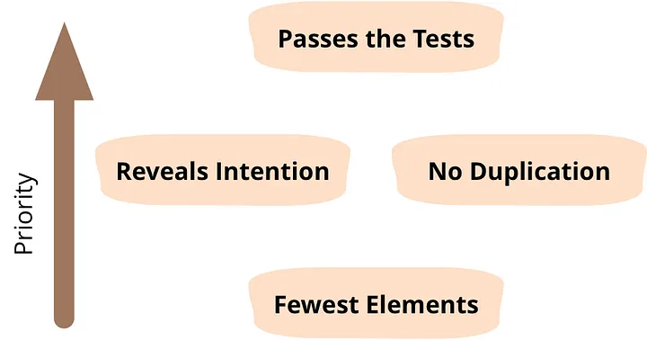

# TDD - Test Driven Development (Desenvolvimento Guiado por Testes)
- Escreve um teste que falha antes do código produtivo
- Faz o teste passar ao construir o código produtivo
- Refatora o código até o teste falhar (ou não)

# Testes Tempestivos (TDD inclusive)
    Teste que ajuda na construção, logo cedo
- Atividade de engenharia(código e design)
- Feedback rápido sobre o código testado (erra cedo)
- Gera código limpo através da "dificuldade" de testar
- Antecipa o custo gasto em correções e debug
- Ainda serve como teste de regreção

# Refatoração Tempestiva

Ajuste da solução em função de:
- uma nova visão sobre o problema
- preparar para uma evolução ou mudança

"Refatoração é a disciplina técnica para reestruturar um determinado código alterando sua estrutura interna sem mudar seu comportamento externo" - Martin Fowler

# 4 Regras da Simplicidade (Martin Fowler: Kent Beck)

1. É prioritário que todos os testes passem.
2. O código feito precisa ser intendido sem comentários, ou seja, legível.
3. Nenhuma duplicação (DRY).
4. Mínimo de elementos, ou seja, quanto menos código fizer para seguir as 3 regras acima melhor.